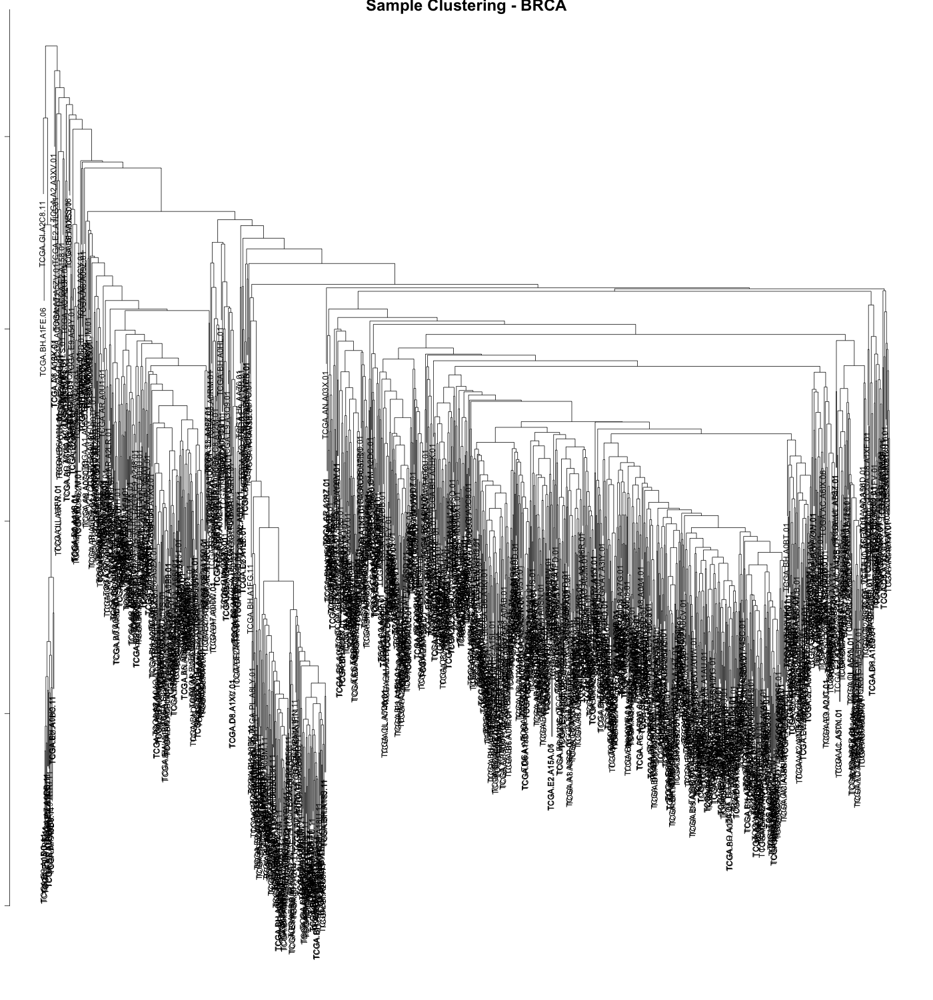
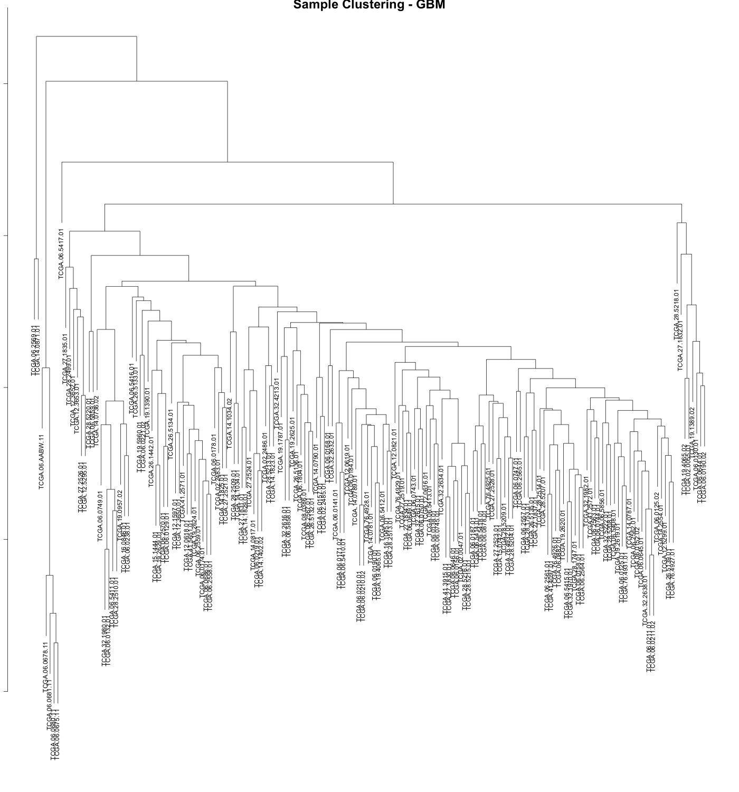
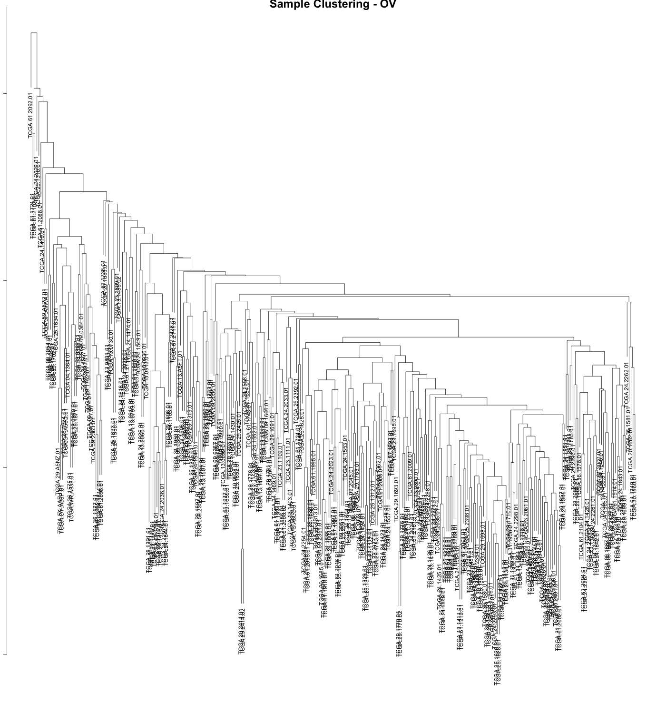
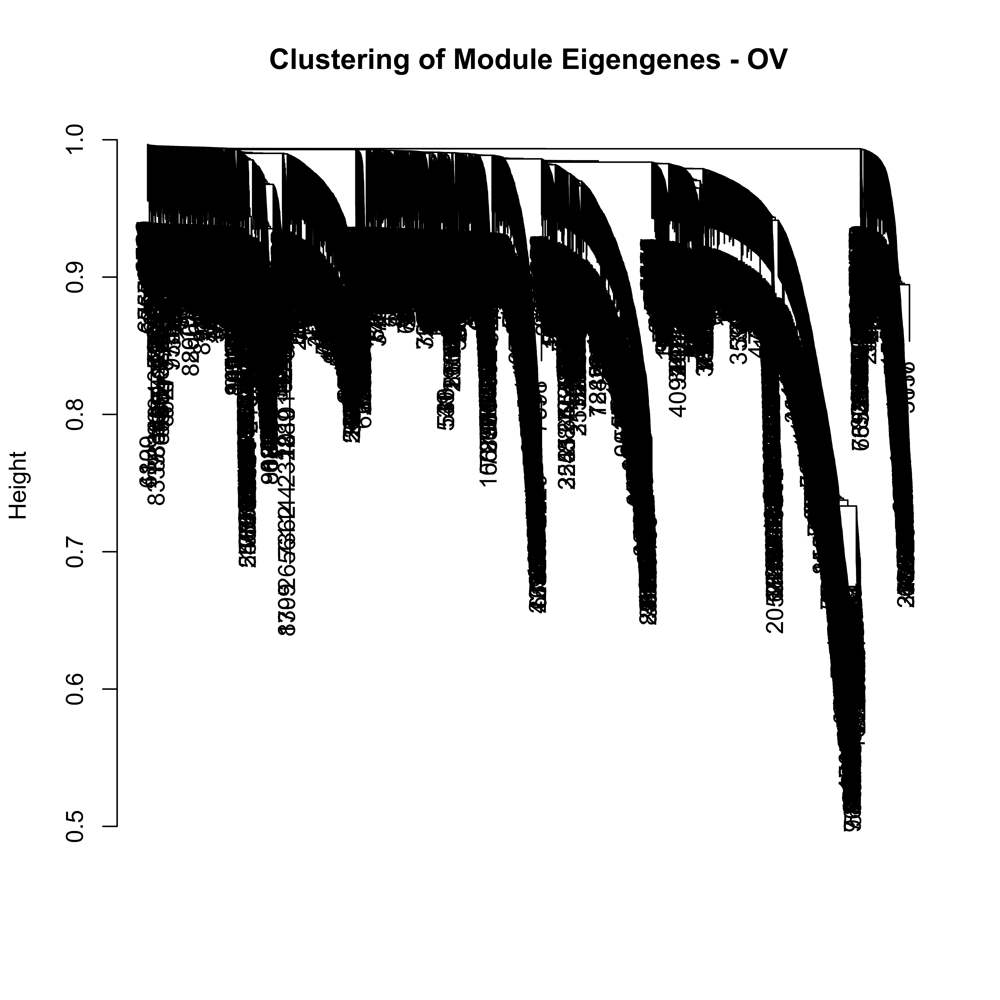

# Exploring Gene Expression Data Using Weighted Gene Co-expression Network Analysis Across Multiple Cancer Types

## CS5228 Knowledge Discovery and Data Mining
A.V. AKILA RAVIHANSA PERERA – A0212216X

TRAN KHANH HUNG – A0212253W

## Method

- WGCNA

Weighted gene correlation network analysis (WGCNA) is a powerful method that uses a topological overlap module approach 
for constructing co-expression networks based on gene expression data. This method involves reconstructing 
gene co-expression modules and summarizing modules using module eigengenes (ME) and intramodular hub genes.

- Gene Enrichment and Pathway Analysis

Biologically interesting modules were identified using Fisher's exact test. The overlapping and union sets of 
genes from theses interesting gene module pairs were subjected to Gene Set Enrichment Analysis using topGO package).

## Dataset

Three gene expression datasets for three cancer types (GBM, OV, BRCA) were selected from TCGA (The Cancer Genome Atlas).

 - Glioblastoma Multiforme (GBM) gene expression by RNAseq
 https://tcga.xenahubs.net/download/TCGA.GBM.sampleMap/HiSeqV2_PANCAN.gz
 
 - Ovarian Serous Cystadenocarcinoma (OV) gene expression by RNAseq
 https://tcga.xenahubs.net/download/TCGA.OV.sampleMap/HiSeqV2_PANCAN.gz
 
 - Breast Invasive Carcinoma (BRCA) gene expression by RNAseq
https://tcga.xenahubs.net/download/TCGA.BRCA.sampleMap/HiSeqV2_PANCAN.gz

## Analysis

###  Data Exploration 

Description     |     BRCA      |  GBM      | OV
:-------------------------:|:-------------------------:|:-------------------------:|:-------------------------:
Filter threshold (CV) | 0.5 | 0.5 | 0.5
Sample Clustering Dendrogram |    |   |  
deepSplit | 3 | 3 | 3
minClusterSize | 30 | 30 | 30
Number of gene modules | 19 | 19 | 20

  

Scale Free Topology Model       |  Mean Connectivity      | Selected Soft Threshold
:-------------------------:|:-------------------------:|:-------------------------:
  |   | 9
  |   | 3
  |   | 6

### Clustering Tree

Genes       |      Module Eigengenes
:-------------------------:|:-------------------------:
 | 
 | 
 | 

  

### Gene Expression Network

Network Heatmap       |      Eigengene Adjacency Heatmap      |      Eigengene Dendrogram
:-------------------------:|:-------------------------:|:-------------------------:
 |    |  
 |    |  
 |   |  

### Pairwise Analysis of Gene Modules

## Overview

Item                     | BRCA and GBM               |  GBM and OV               | OV and BRCA
:-----------------------:|:-------------------------:|:-------------------------:|:-------------------------:
|||
--- Intersection --- |||
Name | [black_darkred_genes.txt](results/4_BRCA_GBM_lowP_Intersection_P0_11-6_black_darkred_genes.txt) | [black_brown_genes.txt](results/4_GBM_OV_lowP_Intersection_P0_13-3_black_brown_genes.txt) | [turquoise_black_genes.txt](results/4_OV_BRCA_lowP_Intersection_P0_14-11_turquoise_black_genes.txt) 
Lowest p-value | 0 | 0 | 0
|||
|||
--- Unique (A) --- |||
Name | [black_genes.txt](results/4_BRCA_GBM_lowP_UniqueA_P0_11-6_black_genes.txt) | [black_genes.txt](results/4_GBM_OV_lowP_UniqueA_P0_13-3_black_genes.txt) | [turquoise_genes.txt](results/4_OV_BRCA_lowP_UniqueA_P0_14-11_turquoise_genes.txt)
Lowest p-value | 0 | 0 | 0
|||
|||
--- Unique (B) --- |||
Name | [darkred_genes.txt](results/4_BRCA_GBM_lowP_UniqueB_P0_11-6_darkred_genes.txt) | [brown_genes.txt](results/4_GBM_OV_lowP_UniqueB_P0_13-3_brown_genes.txt) | [black_genes.txt](results/4_OV_BRCA_lowP_UniqueB_P0_14-11_black_genes.txt)
Lowest p-value | 0 | 0 | 0

  

## Gene Overlap Across Module Pairs

BRCA and GBM               |  GBM and OV               | OV and BRCA
:-------------------------:|:-------------------------:|:-------------------------:
  |   |  
  |   |  

  

## Project Structure and Run Instructions

 - Download and extract datasets to `./data` directory
 - Install dependencies (R packages)
    - Run `0_install_dependencies.R`
    
 - Gene filtering
    - Run `1_wgcna_cluster.R`
    
 - Build gene expression network and identify gene modules
    - Run `2_module_detection.R`
    
 - Generate gene network plots 
    - Run `3_network_visualization.R`

 - Gene Enrichment Analysis
    - Run `4_gene_enrichment.R`
    
